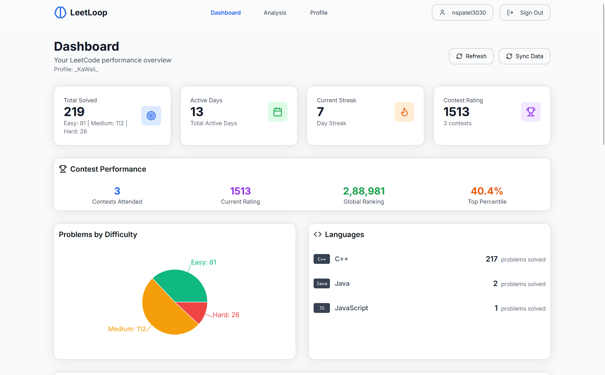
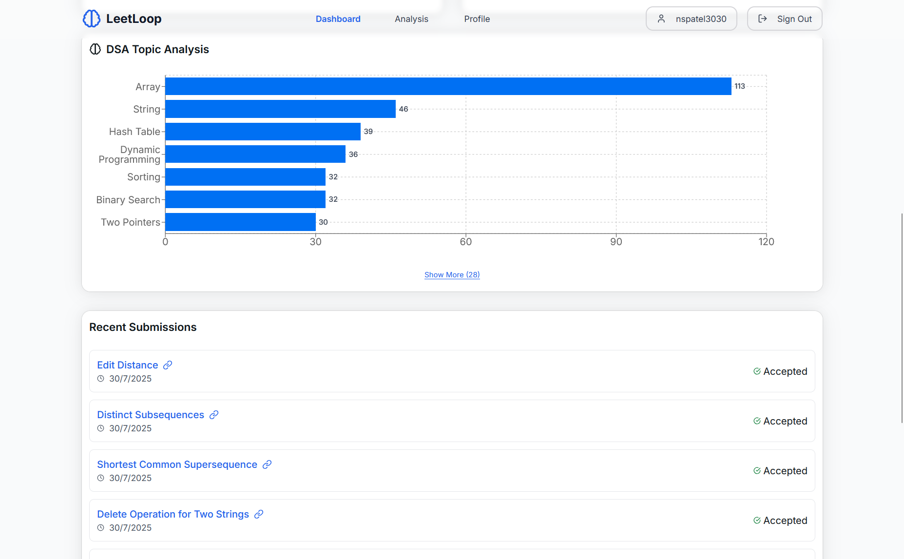
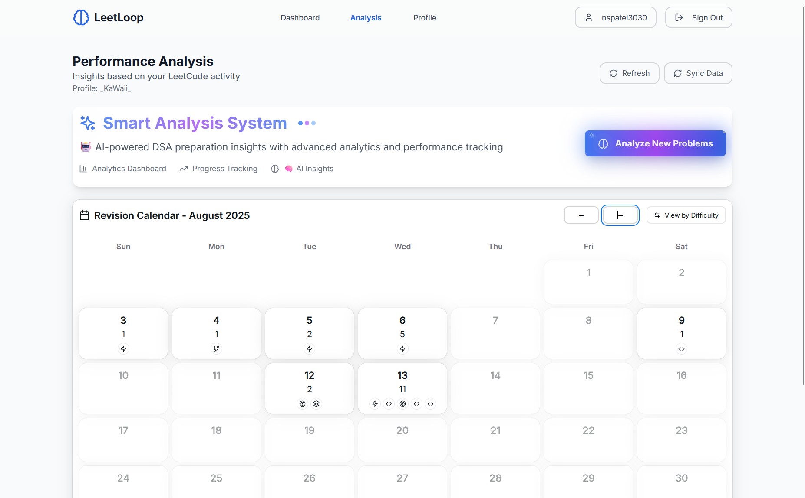
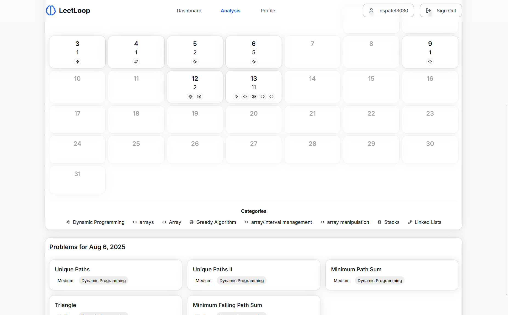

# 🚀 [LeetLoop](https://leetloop.vercel.app) - Smart LeetCode Progress Tracker

<div align="center">


[](https://nextjs.org/)
[](https://reactjs.org/)
[](https://www.typescriptlang.org/)
[](https://supabase.com/)
[](https://vercel.com/)

**AI-powered LeetCode progress tracking with spaced repetition for optimal coding skill retention**

[🚀 Live Demo](https://leetloop.vercel.app) • [✨ Features](#features) • [📦 Installation](#installation) • [🤝 Contributing](#contributing)

</div>

## 📋 Table of Contents

- [Overview](#overview)
- [Features](#features)
- [Screenshots](#screenshots)
- [Tech Stack](#tech-stack)
- [Installation](#installation)
- [Environment Setup](#environment-setup)
- [Usage](#usage)
- [API Documentation](#api-documentation)
- [Contributing](#contributing)
- [License](#license)

## 🎯 Overview

LeetLoop revolutionizes how developers track and improve their coding skills. By combining LeetCode integration with AI-powered analysis and spaced repetition algorithms, it ensures you never forget what you've learned and continuously strengthen weak areas.

### 🧠 Why Spaced Repetition?

Research shows that spaced repetition is the most effective way to move information from short-term to long-term memory. LeetLoop applies this scientifically-proven method to coding practice, ensuring you maintain and improve your algorithmic thinking skills over time.

## ✨ Features

### 📊 **Smart Analytics Dashboard**
- Real-time LeetCode progress synchronization
- Comprehensive difficulty and topic analysis
- Contest performance tracking
- Language usage statistics
- Visual progress charts and insights

### 🤖 **AI-Powered Analysis**
- **Groq LLM Integration**: Advanced problem categorization
- Concept difficulty assessment and weak point identification
- Personalized revision recommendations
- Smart tagging system for better organization

### 📅 **Intelligent Revision Calendar**
- **Spaced Repetition Algorithm**: Optimized recall intervals
- Category-based icon system for visual organization
- Interactive calendar with difficulty indicators
- Automated scheduling for maximum retention

### 🔄 **Seamless Integration**
- Direct LeetCode API integration
- Automatic submission tracking
- Real-time data synchronization
- Supabase OAuth authentication (GitHub, Google, Email)

### 🎨 **Modern UI/UX**
- Responsive design with NextUI components
- Dark/light theme support
- Smooth animations with Framer Motion
- Intuitive navigation and user experience

## 📸 Screenshots

### Dashboard Overview

*Main dashboard showing LeetCode statistics and progress charts*


*Detailed analytics with difficulty distribution and topic analysis*

### AI Analysis View

*AI-powered problem analysis and concept categorization*

### Problem Calendar

*Interactive calendar for tracking problem-solving progress*

## 🛠 Tech Stack

### **Frontend**
- **Framework**: Next.js 14 with App Router
- **Language**: TypeScript
- **Styling**: Tailwind CSS + NextUI
- **Animations**: Framer Motion
- **Charts**: Recharts
- **Icons**: Lucide React

### **Backend & Database**
- **Database**: Supabase (PostgreSQL)
- **Authentication**: Supabase Auth
- **API**: Next.js API Routes
- **AI**: Groq LLM API

### **External APIs**
- **LeetCode**: Custom GraphQL integration
- **Date Handling**: date-fns

### **Deployment**
- **Platform**: Vercel
- **Domain**: Custom domain support
- **CI/CD**: Automatic deployment on push

## 🚀 Installation

### Prerequisites

- Node.js 18.0 or later
- npm/yarn/pnpm
- Supabase account
- Groq API key

### Quick Start

1. **Clone the repository**
   ```bash
   git clone https://github.com/NIrmalpat3l/LeetLoop-DSA-MATE.git
   cd LeetLoop-DSA-MATE
   ```

2. **Install dependencies**
   ```bash
   npm install
   # or
   yarn install
   # or
   pnpm install
   ```

3. **Set up environment variables**
   ```bash
   cp .env.example .env.local
   ```

4. **Start development server**
   ```bash
   npm run dev
   ```

5. **Open browser**
   Navigate to `http://localhost:3000`

## 🔧 Environment Setup

Create a `.env.local` file in the root directory:

```env
# Supabase Configuration
NEXT_PUBLIC_SUPABASE_URL=your_supabase_url
NEXT_PUBLIC_SUPABASE_ANON_KEY=your_supabase_anon_key

# Groq API Configuration
GROQ_API_KEY=your_groq_api_key

# Optional: Additional configuration
NODE_ENV=development
```

### Supabase Database Schema

Run these SQL commands in your Supabase SQL editor:

```sql
-- Create profiles table
create table profiles (
  id uuid references auth.users on delete cascade,
  full_name text,
  leetcode_username text,
  email text,
  avatar_url text,
  created_at timestamp with time zone default timezone('utc'::text, now()) not null,
  updated_at timestamp with time zone default timezone('utc'::text, now()) not null,
  primary key (id)
);

-- Create problem_analysis table
create table problem_analysis (
  id bigint generated by default as identity,
  user_id uuid references auth.users on delete cascade not null,
  problem_title text not null,
  problem_slug text not null,
  difficulty text not null,
  category text not null,
  concepts_analysis jsonb,
  revision_date date not null,
  analyzed_at timestamp with time zone default timezone('utc'::text, now()) not null,
  primary key (id),
  unique(user_id, problem_slug)
);

-- Enable Row Level Security
alter table profiles enable row level security;
alter table problem_analysis enable row level security;

-- Create policies
create policy "Users can view own profile" on profiles for select using (auth.uid() = id);
create policy "Users can update own profile" on profiles for update using (auth.uid() = id);
create policy "Users can insert own profile" on profiles for insert with check (auth.uid() = id);

create policy "Users can view own analysis" on problem_analysis for select using (auth.uid() = user_id);
create policy "Users can insert own analysis" on problem_analysis for insert with check (auth.uid() = user_id);
create policy "Users can update own analysis" on problem_analysis for update using (auth.uid() = user_id);
```

## 📖 Usage

### 1. **Account Setup**
- Sign up using email, GitHub, or Google OAuth
- Add your LeetCode username in profile settings
- System automatically syncs your LeetCode submissions

### 2. **Dashboard Features**
- View comprehensive progress statistics
- Track contest performance and ratings
- Monitor language usage and preferences
- Analyze problem-solving patterns

### 3. **AI Analysis**
- Click "Sync Data" to process submissions
- Get AI-powered categorization and difficulty assessment
- Receive personalized study recommendations
- Track concept mastery over time

### 4. **Problem Analysis & Review**
- Navigate to Analysis page for detailed insights
- Review concept-based problem categorization
- Follow spaced repetition recommendations
- Track your learning progress over time

## 🔗 API Documentation

### LeetCode Integration Endpoints

```typescript
// Get user profile and statistics
GET /api/leetcode/user/${username}

// Analyze submissions with AI
POST /api/analyze-submissions
Body: { submissions: Submission[] }
```

### Database Schemas

```typescript
interface Profile {
  id: string
  full_name: string
  leetcode_username: string
  email: string
  avatar_url?: string
}

interface ProblemAnalysis {
  id: number
  user_id: string
  problem_title: string
  problem_slug: string
  difficulty: 'Easy' | 'Medium' | 'Hard'
  category: string
  concepts_analysis: {
    concepts: string[]
    algorithm: string
    approach: string
    core_concept: string
  }
  revision_date: string
}
```

## 🤝 Contributing

We welcome contributions! Please see our [Contributing Guidelines](CONTRIBUTING.md) for details.

### Development Workflow

1. Fork the repository
2. Create a feature branch: `git checkout -b feature/amazing-feature`
3. Commit changes: `git commit -m 'Add amazing feature'`
4. Push to branch: `git push origin feature/amazing-feature`
5. Open a Pull Request

### Code Style

- Use TypeScript for type safety
- Follow ESLint and Prettier configurations
- Write meaningful commit messages
- Add tests for new features

## 📝 License

This project is licensed under the MIT License - see the [LICENSE](LICENSE) file for details.

## 🙏 Acknowledgments

- **LeetCode** for providing the platform and inspiration
- **Supabase** for excellent backend infrastructure
- **Groq** for powerful AI capabilities
- **Next.js** team for the amazing framework
- **Vercel** for seamless deployment

## 📞 Support

- 🐛 **Bug Reports**: [GitHub Issues](https://github.com/NIrmalpat3l/LeetLoop-DSA-MATE/issues)
- 💬 **Discussions**: [GitHub Discussions](https://github.com/NIrmalpat3l/LeetLoop-DSA-MATE/discussions)
- 📧 **Email**: nspatel3030@gmail.com

---

<div align="center">

**[⭐ Star this repo](https://github.com/NIrmalpat3l/LeetLoop-DSA-MATE)** if you find it helpful!

Made with ❤️ by [Nirmal Patel](https://github.com/NIrmalpat3l)

</div>
